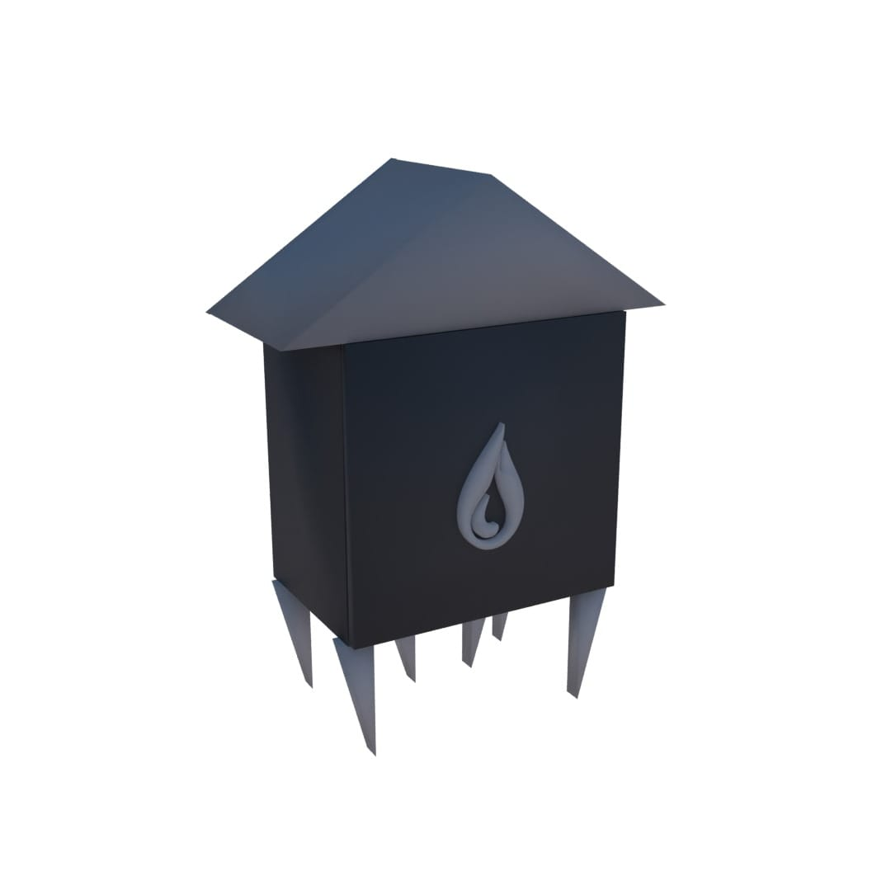
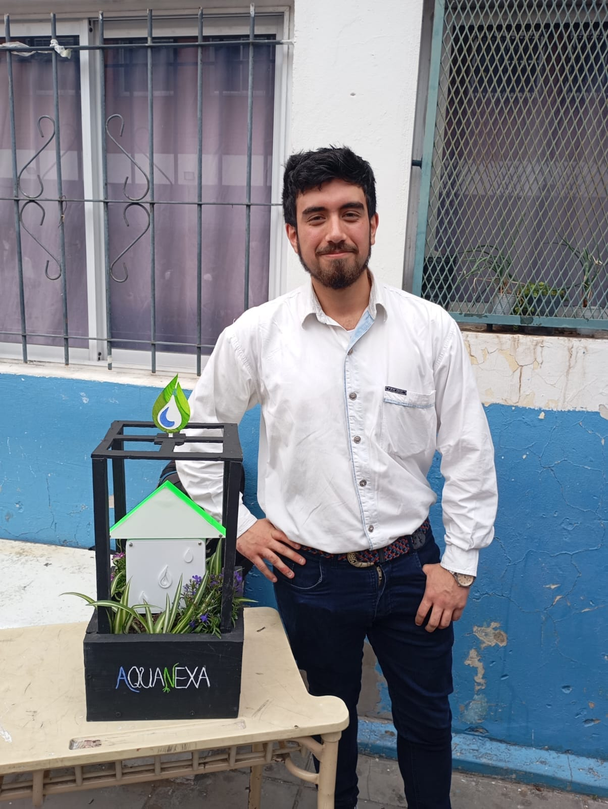

<p align="center">
  
</p>

<h1 align="center">AquaNexa 💧</h1>

<p align="center">
  Sistema de riego automatizado y autoalimentado, controlado desde una aplicación móvil.<br>
  Automated, self-powered irrigation system controlled from a mobile app.
</p>

<p align="center">
  🇪🇸 <a href="#español">Español</a> &nbsp;|&nbsp; 🇬🇧 <a href="#english">English</a>
</p>

---

## Español

### 📋 Descripción

**AquaNexa** es un sistema de riego automatizado desarrollado como proyecto final de la escuela secundaria técnica en programación. Combina hardware (Arduino, sensores y actuadores), una página web con base de datos, y una aplicación móvil que permite monitorear y controlar el riego de forma remota vía Bluetooth.

El dispositivo físico fue diseñado para funcionar de manera **autónoma y autoalimentada**, incorporando paneles solares y un gabinete propio pensado para anclarse directamente en la tierra junto a la planta.

<p align="center">
  
</p>

### ⚙️ Funcionalidades

- Medición del **porcentaje de humedad del suelo** en tiempo real.
- Selección del **nivel de necesidad de riego** (muy baja, baja, regular, alta, muy alta) desde la app.
- Conexión y emparejamiento por **Bluetooth** con el dispositivo AquaNexa.
- Registro y consulta de datos a través de una **página web** conectada a base de datos.
- Distintos prototipos de hardware probados con sensores adicionales (pH del suelo, temperatura) y una bomba para generar presión de agua.
- Gabinete diseñado y modelado a medida (bocetado y luego modelado en 3D) para resistir intemperie y autoalimentarse con energía solar.


### 🛠️ Tecnologías utilizadas

| Área | Tecnologías |
|---|---|
| **Hardware** | Arduino, sensores de humedad/temperatura/pH, módulo relé, paneles solares |
| **Aplicación móvil** | Programación por bloques (interfaz de configuración y conexión Bluetooth) |
| **Página web** | HTML, CSS, JavaScript |
| **Backend / Base de datos** | PHP, MySQL |
| **Diseño de gabinete** | Boceto propio + modelado 3D |

### 📁 Estructura del repositorio

```
AquaNexa/
├── Programacion-Arduino/   → Código fuente para los distintos prototipos de hardware
├── Proyecto-Web/           → Página web (HTML, CSS, JS, PHP)
├── AquaNexaApp.apk         → Aplicación móvil instalable (Android)
├── aquanexa.sql            → Script de la base de datos MySQL
└── Precios.txt             → Presupuesto y costos de componentes del proyecto
```

### 🚀 Uso básico

1. Cargar el sketch correspondiente de `Programacion-Arduino/` en la placa.
2. Importar `aquanexa.sql` en un servidor MySQL y desplegar `Proyecto-Web/` en un servidor con soporte PHP.
3. Instalar `AquaNexaApp.apk` en un dispositivo Android.
4. Emparejar por Bluetooth con el dispositivo AquaNexa, seleccionar el nivel de riego deseado y realizar la medición.

### 👥 Equipo

Proyecto grupal desarrollado por 3 integrantes, con **Lucas Britos** como líder del equipo:

- **Lucas Britos** — Líder del proyecto ([GitHub](https://github.com/zuria4) · [LinkedIn](https://www.linkedin.com/in/lucas-britos-85197b3b6))
- **Santiago Ledesma**
- **Brandon Torres**

<p align="center">
  
</p>

---

## English

### 📋 Description

**AquaNexa** is an automated irrigation system built as a final-year project for a technical high school in programming. It combines hardware (Arduino, sensors and actuators), a web page with a database, and a mobile app that lets users remotely monitor and control irrigation via Bluetooth.

The physical device was designed to run **autonomously and self-powered**, using solar panels and a custom enclosure built to be anchored directly into the soil next to the plant.

### ⚙️ Features

- Real-time **soil moisture percentage** measurement.
- Selection of the **irrigation need level** (very low, low, regular, high, very high) from the app.
- **Bluetooth** pairing and connection with the AquaNexa device.
- Data logging and lookup through a **web page** connected to a database.
- Multiple hardware prototypes tested with additional sensors (soil pH, temperature) and a pump for water pressure.
- Custom-designed enclosure (hand-sketched, then 3D-modeled) built to withstand outdoor conditions and self-power via solar panels.

### 🛠️ Tech stack

| Area | Technologies |
|---|---|
| **Hardware** | Arduino, moisture/temperature/pH sensors, relay module, solar panels |
| **Mobile app** | Block-based programming (Bluetooth connection & configuration UI) |
| **Web page** | HTML, CSS, JavaScript |
| **Backend / Database** | PHP, MySQL |
| **Enclosure design** | Hand sketch + 3D modeling |

### 📁 Repository structure

```
AquaNexa/
├── Programacion-Arduino/   → Source code for the different hardware prototypes
├── Proyecto-Web/           → Web page (HTML, CSS, JS, PHP)
├── AquaNexaApp.apk         → Installable mobile app (Android)
├── aquanexa.sql            → MySQL database script
└── Precios.txt             → Project component budget/costs
```

### 🚀 Basic usage

1. Flash the corresponding sketch from `Programacion-Arduino/` onto the board.
2. Import `aquanexa.sql` into a MySQL server and deploy `Proyecto-Web/` on a PHP-enabled server.
3. Install `AquaNexaApp.apk` on an Android device.
4. Pair via Bluetooth with the AquaNexa device, select the desired irrigation level, and run a measurement.

### 👥 Team

Group project built by 3 members, with **Lucas Britos** as team lead:

- **Lucas Britos** — Project lead ([GitHub](https://github.com/zuria4) · [LinkedIn](https://www.linkedin.com/in/lucas-britos-85197b3b6))
- **Santiago Ledesma**
- **Brandon Torres**
